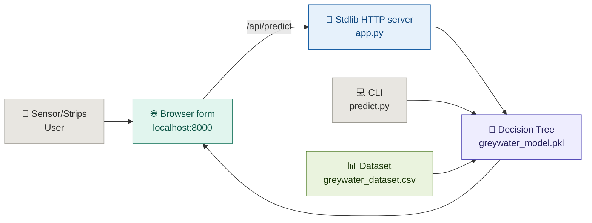

<div align="center">


# Greywater Testing Kit + AI — From Sample to Reuse Decision

**Test it. Enter it. Get a reuse decision you can actually act on.**

Greywater Testing Kit transforms pH, turbidity, TDS and microbial screening results into a reuse verdict — garden-safe, flushing-only, or unsafe — powered by a decision-tree classifier trained on a 1500-sample dataset grounded in public water-quality distributions and CPCB/WHO reuse thresholds.

</div>

---

## The Problem

Household greywater (kitchens, bathrooms, laundry) flows away untested every day.

**Households** have no easy way to know if their greywater is safe to reuse for gardening, irrigation, or flushing — lab tests are slow and expensive, strip kits give raw numbers with no interpretation.

**Communities** lose a massive reuse opportunity: safe greywater could offset freshwater demand, but without guidance it becomes wastewater instead.

---

## The Solution

This kit bridges the gap between a sensor/strip reading and a reuse decision.

A user enters four readings:

- **pH** — acidity/alkalinity of the sample
- **Turbidity (NTU)** — cloudiness / suspended solids
- **TDS (mg/L)** — total dissolved solids
- **Microbial presence** — presence/absence screening

The system outputs:

- A **reuse verdict** (safe-garden / flushing-only / unsafe), colour-coded green / orange / red
- **Actionable advice** (what you can do with this water right now)
- **Threshold context** (pH 6.0–8.5 · turbidity <10 garden, <20 flushing · TDS <500 garden, <1000 flushing)
- A **dataset-backed rationale** — the tree's learned splits rediscover the domain thresholds from data

---

## Core User Flow

```
Sensor / strip readings (pH / turbidity / TDS / microbial)
        ↓
Web form (app.py) or CLI (predict.py)
        ↓
Decision-Tree classifier (max_depth=5, 90.7% test accuracy)
        ↓
Reuse class + advice (green / orange / red)
        ↓
IDF annexure (dataset + metrics + demo cases) → Filing
```

---

## Features

| Feature | Status |
|---|---|
| Manual reading input (pH, turbidity, TDS, microbial) | ✅ |
| Decision-tree reuse classifier (garden / flushing-only / unsafe) | ✅ |
| Zero-dependency web app (stdlib `http.server` + sklearn, no Flask) | ✅ |
| `/api/predict` JSON endpoint | ✅ |
| `/api/stats` dataset stats endpoint | ✅ |
| CLI demo (`predict.py`) | ✅ |
| 1500-row dataset, committed (`greywater_dataset.csv`) | ✅ |
| Trained model, committed (`greywater_model.pkl`) | ✅ |
| IDF-ready technical note (`AI_TECHNICAL_NOTE.md`) | ✅ |
| IoT auto-feed (ESP32 / serial / BLE) | ❌ |
| Strip photo scan | ❌ |
| Cloud / community trend aggregation | ❌ |

---

## AI / Model

A single **DecisionTreeClassifier (max_depth=5)**, 80/20 stratified split, 300 test samples.

| Metric | Value |
|---|---|
| Test accuracy | **0.907** |
| Unsafe (P / R) | 0.97 / 0.93 |
| Flushing-only (P / R) | 0.86 / 0.90 |
| Garden (P / R) | 0.70 / 0.79 |

Key learned splits match domain knowledge — microbial_present ≤ 0.5, turbidity ≤ 19.9 NTU, TDS ≤ 495 / 1001 mg/L, pH 6.01–8.5 — i.e. the model rediscovers the IDF Table-4 ranges from data, which strengthens the inventive-step argument.

**Dataset (`greywater_dataset.csv`, 1500 rows):** distributions modeled on Kaggle water-potability + CPCB/WHO greywater literature, labeled by IDF Table-4 rules with 5% label noise for realism. Class balance: unsafe 910 / flushing-only 444 / garden 146.

**Demo predictions (reproducible via `predict.py` + `greywater_model.pkl`):**

- `[7.2, 5 NTU, 320 mg/L, no microbes]` → safe_garden
- `[7.8, 15 NTU, 800 mg/L, no microbes]` → safe_flushing_only
- `[8.9, 30 NTU, 1200 mg/L, microbes]` → unsafe

---

## Architecture



---

## Tech Stack

- Python stdlib (`http.server`, `json`, `pickle`) — no Flask, no install friction
- scikit-learn + pandas (inference only; training done offline, same packages)
- Single-file frontend (inline HTML/CSS/JS served by `app.py`, no build step)

---

## Project Structure

```
greywater/
│
├── app.py                    # Web app — serves form + /api/predict + /api/stats
├── predict.py                # CLI demo — python3 predict.py 7.2 5 320 0
├── greywater_dataset.csv     # 1500-row dataset (committed)
├── greywater_model.pkl       # Trained depth-5 decision tree (committed)
├── AI_TECHNICAL_NOTE.md      # Paste-ready IDF Q9/Q12 text + metrics + demo cases
├── .gitignore                # Ignores pycache/venv/editors/*.docx, keeps csv+pkl
└── README.md                 # This file
```

---

## Run Locally

**Step 1 — Requirements**

Python 3 with `scikit-learn` + `pandas` (system Python already has them; no venv needed):

```bash
python3 -c "import sklearn, pandas; print('ok')"
```

**Step 2 — Start the web app**

```bash
python3 app.py
```

```
Serving on http://localhost:8000
```

Open `http://localhost:8000`, enter readings, click **Analyze Water**.

**Step 3 — Try the CLI**

```bash
python3 predict.py 7.2 5 320 0       # → safe_garden
python3 predict.py 8.9 30 1200 1     # → unsafe
```

---

## Verify the backend is working

```bash
curl -X POST http://localhost:8000/api/predict \
  -H "Content-Type: application/json" \
  -d '{"pH":7.2,"turbidity_NTU":5,"TDS_mgL":320,"microbial_present":0}'
# → {"class": 0, "label": "SAFE — Garden/Irrigation", ...}
```

```bash
curl http://localhost:8000/api/stats
# → {"rows": 1500, "accuracy": 0.907, "dist": {...}}
```

---

## API Endpoints

| Method | Endpoint | Description |
|---|---|---|
| `GET` | `/` | Input form (pH / turbidity / TDS / microbial → verdict) |
| `POST` | `/api/predict` | Body `{pH, turbidity_NTU, TDS_mgL, microbial_present}` → `{class, label, color, advice}` |
| `GET` | `/api/stats` | `{rows, accuracy, dist}` from the committed CSV |

---

## IDF Filing Note

Paste-ready paragraph (also in `AI_TECHNICAL_NOTE.md`):

> "The AI module is a depth-5 decision-tree classifier trained on a 1500-sample greywater dataset (pH, turbidity, TDS, microbial presence; labels: garden-safe / flushing-only / unsafe per pH 6.0–8.5, turbidity <20 NTU, TDS <1000 mg/L). Stratified 80/20 evaluation gives 90.7% accuracy, deployable offline on-device via exported tree rules."

Attach `greywater_dataset.csv` + `greywater_model.pkl` as annexure proof of a working model (moves Q11 beyond "idea phase").

---

## Known Limitations

- **Dataset is modeled, not measured.** Sampled from public distributions + IDF thresholds, not real lab greywater samples — disclose as synthetic-grounded; cannot yet claim lab validation (IDF Q11).
- **Manual entry only.** No IoT sensor auto-feed despite the IDF's IoT framing.
- **Microbial is binary.** Presence/absence screening; no strip-photo image path.
- **No persistence.** No DB/cloud/community trends (IDF Q6/Q7 mention them); stats come straight from the CSV.
- **Garden class is weakest.** Only 146 samples; precision 0.70 / recall 0.79 — collect more garden-safe samples to fix.

---

## Future Scope

| Feature | Why |
|---|---|
| IoT feed (ESP32 → serial/BLE → auto-fill form) | Close the IDF's sensor promise |
| CSV logging + trend page | Community-level monitoring (IDF Q6/Q7) |
| Strip photo scan (OpenCV threshold → turbidity/microbial hint) | Match Q6 "scan results" claim |
| Real lab samples appended to CSV + retrain | Move Q11 to prototype-validated |
| Export PDF report per test | Jeweller-style spec sheet equivalent for households |
